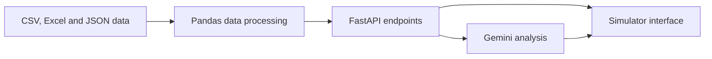

<div align="center">

# U_HACK — U Cluj Tactical AI

**A football analytics and tactical decision-support application**


</div>

---

## Overview

**U_HACK — U Cluj Tactical AI** is a football analytics application that combines player statistics, GPS performance data, tactical calculations, and generative AI.

The application provides player information through a FastAPI backend and serves a football tactical simulator interface. Coaches can explore player data, ask questions about an individual player, and request a tactical recommendation based on opponent statistics.

## Problem and Solution

Football performance data is often spread across different files and formats. This project brings together tactical statistics, GPS measurements, and match simulation data in one application.

The backend prepares and connects the data, exposes it through API endpoints, and uses it to support player analysis and tactical recommendations.

## Key Features

- Loads and prepares player statistics from CSV data.
- Reads GPS performance data from Excel workbooks.
- Matches records using normalized player names.
- Provides a player list and individual player details.
- Combines player information with GPS statistics when available.
- Offers an AI chat endpoint for questions about a selected player.
- Generates opponent-based tactical recommendations.
- Returns player simulation data from JSON files.
- Serves the tactical simulator interface through FastAPI.

## Architecture

The application is organized into four logical layers:

| Layer | Responsibility |
|---|---|
| **User interface** | The HTML simulator presents the tactical interface and visualizations. |
| **API** | FastAPI exposes endpoints for players, analysis, strategy, and simulation data. |
| **Data processing** | Pandas loads, cleans, normalizes, aggregates, and combines the source datasets. |
| **AI analysis** | Google Gemini generates concise player answers and tactical summaries based on the supplied statistics. |

### Data flow



The backend loads the source data, prepares it for analysis, and makes the results available through API routes. The interface uses those results to display player and tactical information.

## Data Processing

### Tactical statistics

Player statistics are loaded from a CSV file. The backend handles empty rows and missing values, then normalizes player names to make matching more reliable.

### GPS performance data

GPS information is read from Excel files. The backend identifies the player and performance columns, converts measurements to numeric values, and calculates player-level averages for available metrics such as distance, accelerations, and sprints.

### Player matching

Names from the tactical and GPS datasets are normalized before they are matched. When GPS data is available for a player, it can be combined with that player's tactical statistics.

## API Endpoints

| Method | Endpoint | Description |
|---|---|---|
| `GET` | `/players` | Returns the available players. U Cluj players are prioritized in the list. |
| `GET` | `/player/{player_id}` | Returns details for one player and their GPS data, when available. |
| `GET` | `/player/{player_id}/chat?message=...` | Answers a question about a selected player using the available statistics. |
| `GET` | `/tactics/victory-strategy/{opp_id}` | Generates a tactical recommendation and a list of suitable U Cluj players based on opponent data. |
| `GET` | `/tactics/simulation-data` | Returns match event and tracking data from JSON files. |
| `GET` | `/tactics/simulator-page` | Serves the tactical simulator HTML page. |

FastAPI's interactive API documentation is available at:

```text
http://127.0.0.1:8000/docs
```

## Project Structure

The main application files are:

```text
U_HACK/
├── main.py
└── football_tactical_simulator_euro2024_final.html
```

- **`main.py`** — configures the FastAPI application, loads data, processes player and GPS statistics, defines API endpoints, and connects to Gemini.
- **`football_tactical_simulator_euro2024_final.html`** — provides the tactical simulator interface.

The backend also expects supporting CSV, Excel, JSON, and static files. Their location is configured in `main.py`.

## Technologies

- **Python** — backend implementation
- **FastAPI** — API and web server
- **Pandas** — tabular data processing
- **Google Gemini API** — AI-generated player and tactical analysis
- **HTML, CSS, and JavaScript** — simulator interface
- **CSV, Excel, and JSON** — input data formats

## Getting Started

### Requirements

- Python 3.10 or later
- A Google Gemini API key
- The project’s statistical and simulation data files

### 1. Clone the repository

```bash
git clone https://github.com/cristina1200/U_HACK.git
cd U_HACK
```

### 2. Create and activate a virtual environment

```bash
python -m venv .venv
```

On Windows:

```bash
.venv\Scripts\activate
```

On macOS or Linux:

```bash
source .venv/bin/activate
```

### 3. Install dependencies

```bash
pip install fastapi uvicorn pandas openpyxl google-genai
```

### 4. Configure the data files

The backend needs the input CSV, Excel, JSON, and static files used by the application. Update the data directory configuration in `main.py` so it points to the location of those files on your computer.

### 5. Configure the Gemini API key

Store the Gemini API key outside the source code, such as in an environment variable, and read it from the environment in `main.py`. Do not commit API keys to GitHub.

### 6. Start the server

```bash
uvicorn main:app --reload
```

The API runs locally at:

```text
http://127.0.0.1:8000
```

Open the simulator page at:

```text
http://127.0.0.1:8000/tactics/simulator-page
```

## Team Contribution

This project was developed for **U_HACK**, with **Cristina Fatan as team captain**. The project brought together football analysis, data processing, API development, and AI-assisted tactical insights.

## Author

**Cristina Fatan**  
[GitHub Profile](https://github.com/cristina1200)
